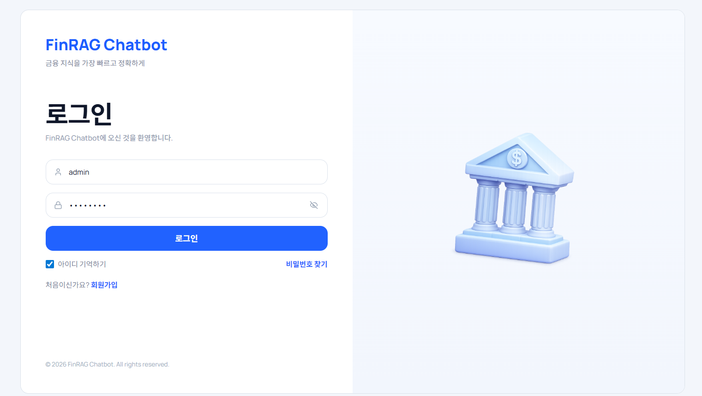
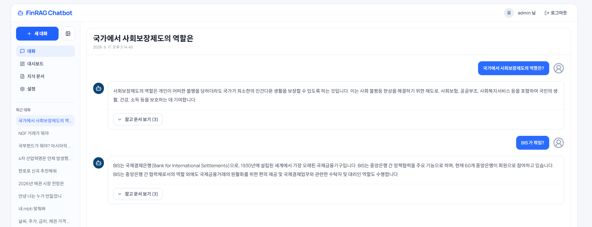
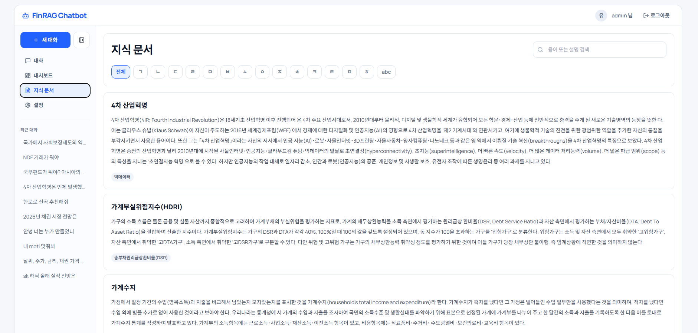
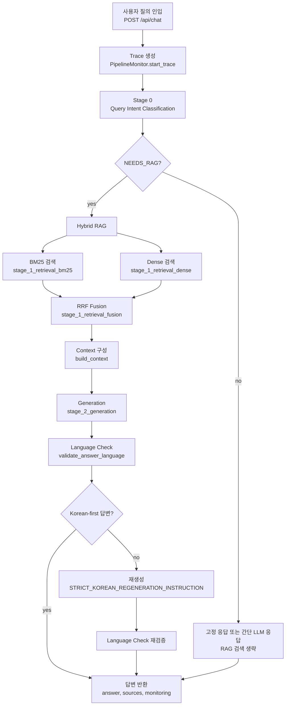

# finance-terms-rag-chatbot

금융 용어 문서를 기반으로 답변하는 RAG 챗봇 프로젝트입니다.

## 프론트엔드 화면 예시

### 로그인



### 채팅



### 지식 문서



## 1) 설치

```bash
python -m venv .venv
.venv\Scripts\activate
pip install -r requirements.txt
```

환경변수는 루트의 `.env`를 사용합니다.

주요 LLM 관련 환경변수:

```env
GENERATION_PROVIDER=ollama
OLLAMA_BASE_URL="http://localhost:11434"
OLLAMA_MODEL="qwen2.5:7b-instruct"
OLLAMA_TIMEOUT=300
```

- `GENERATION_PROVIDER=ollama`: 로컬 개발용 Ollama 생성 모드
- `OLLAMA_MODEL`: 로컬 답변 생성 모델

## 2) 백엔드 실행 (FastAPI)

```bash
uvicorn backend.app.main:app --reload --host 0.0.0.0 --port 8000
```

레거시 호환 경로인 `src.serving.app:app`도 유지되지만, 새 엔트리포인트는 `backend.app.main:app`입니다.

기본 API 엔드포인트:

- `GET /health`
- `POST /api/auth/login`
- `POST /api/auth/signup`
- `POST /api/chat`
- `GET /api/monitor/summary`
- `GET /api/monitor/recent?limit=20`

## 3) 프론트엔드 실행 (Vite + React + TypeScript)

```bash
cd frontend-web
cp .env.example .env
npm install
npm run dev
```

기본적으로 `VITE_API_BASE_URL=http://localhost:8000` 백엔드와 연동합니다. 프론트엔드 코드는 API 요청에 `/api` 경로를 자동으로 붙입니다.

역할 기반 라우팅:

- `user`: `/chat`만 접근 가능
- `admin`: `/chat`, `/admin` 접근 가능

## 4) 인증 방식 (Admin, General User)

`.env` 파일에 아래 값을 추가할 경우 JWT 기반 인증 모듈이 활성화됩니다.

```env
API_AUTH_REQUIRED=true
API_JWT_SECRET=user-generated-password
API_JWT_ALGORITHM=HS256
API_ADMIN_USERNAME=admin
API_ADMIN_PASSWORD=admin123
API_ADMIN_ROLE=admin
```

인증 동작:

- `POST /api/auth/login`: 기존 사용자 로그인 후 bearer token 반환
- `POST /api/auth/signup`: 새 사용자 생성 후 bearer token 반환
- `/api/chat` 및 `/api/chat/stream`: 인증 필요
- `/api/monitor/summary`, `/api/monitor/recent`: 인증 필요, `admin` 역할만 허용

FastAPI endpoint별 요청/응답 예시는 `backend/app/README.md`를 참고합니다.

주의:

- 현재 사용자 계정은 로컬 DB에 저장되지 않습니다.
- 회원가입한 사용자는 백엔드 프로세스가 실행 중일 때만 메모리에 유지됩니다.
- 백엔드 재시작 후에는 `.env`의 기본 admin 계정만 다시 생성됩니다.

## 5) RAG 질의 처리 흐름

현재 질의 처리 흐름은 `src/serving/rag_service.py`의 `RAGService.answer()`에서 시작해 `src/generation/rag_pipeline.py`의 `RAGPipeline.answer()`로 이어집니다.



구현 매핑:

- 질의 인입/서비스 어댑터: `backend.app.main:app` -> `src.serving.rag_service.RAGService`
- Query intent classification: `QueryIntentClassifier`가 rule 기반 분류를 먼저 수행하고, unresolved case에서 OpenAI LLM classifier를 선택적으로 사용합니다.
- RAG 분기: intent가 `NEEDS_RAG`가 아니면 검색을 생략하고 고정 응답 또는 간단 LLM 응답을 반환합니다.
- Hybrid RAG: `build_retriever(mode="hybrid")`가 dense retriever와 BM25 retriever를 만들고 `HybridRetriever`가 두 결과를 RRF 방식으로 fusion합니다.
- Generation: fusion 결과를 `build_context()`로 prompt context에 넣고 설정된 generator(Ollama 또는 OpenAI)로 답변을 생성합니다.
- Language check: `validate_answer_language()`가 중국어/일본어 drift를 검사하며, 실패하면 한국어 재작성 instruction을 붙여 한 번 재생성합니다.
- Monitoring: 각 주요 단계는 `PipelineMonitor`에 stage metric으로 기록됩니다.

## 6) 운영 문서

- [DEPLOYMENT_GUIDE.md](DEPLOYMENT_GUIDE.md): Vercel, Render Docker, Chroma HTTP 서비스 기준 배포 가이드
- [MONITORING_METRICS.md](MONITORING_METRICS.md): stage 모니터링 로그 적재 흐름과 산출 지표

## 7) 프로젝트 디렉토리 구조

```text
finance-terms-rag-chatbot/
├─ data/
│  ├─ raw/                  # 원본 PDF
│  ├─ processed/            # 전처리 결과 (예: final_chunk.json)
│  └─ eval/                 # 평가 데이터셋 (예: golden_testset.csv)
├─ notebooks/               # 실험/분석 노트북
├─ backend/
│  └─ app/                  # FastAPI 전용 계층 (auth/JWT/RBAC/router/middleware/DB session)
├─ frontend-web/            # Vite + React + TypeScript 프론트엔드
├─ src/
│  ├─ serving/              # FastAPI와 RAG 파이프라인 사이 어댑터
│  │  ├─ app.py
│  │  └─ rag_service.py
│  ├─ ingestion/            # 데이터 파싱/정제
│  ├─ embedding/            # 임베딩/벡터스토어 구축
│  ├─ retrieval/            # BM25/Dense/Hybrid 검색기
│  ├─ generation/           # 프롬프트/답변 생성 파이프라인
│  ├─ evaluation/           # retrieval/generation 평가 파이프라인
│  └─ common/               # 공통 설정/스키마/IO
├─ chroma_clova/            # Chroma DB (clova)
├─ chroma_openai/           # Chroma DB (openai)
├─ chroma_local/            # Chroma DB (local)
├─ requirements.txt
└─ README.md
```
