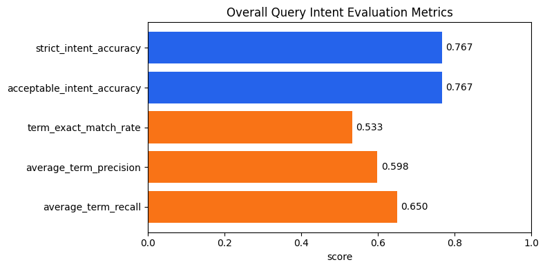
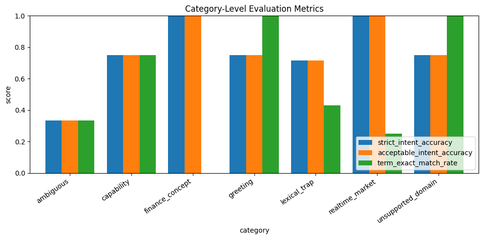
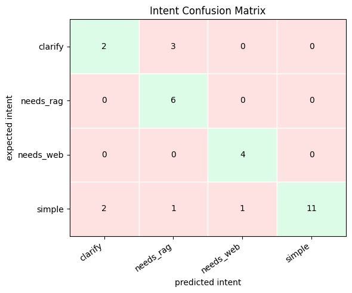

# Query Intent Classification Exp 001 - Baseline

## 실험 세팅

`notebooks/06_query_intent_classification.ipynb`에서 Rule base classifier만 사용해 query intent classification 성능을 평가했습니다. 이번 실험에는 LLM fallback을 사용하지 않았으며, 사전 매칭 및 규칙 기반 분기만으로 `simple`, `clarify`, `needs_rag`, `needs_web` intent를 예측했습니다.

- 평가 데이터: `data/eval/testset/classify_query_intent_v1.csv`
- 사용자 query 형태소 분석 사전: `data/processed/kiwi_user_dict.tsv`
- 평가 방식: Rule base classifier only
- 평가 문항 수: 30개
- 실험 산출물 저장 경로: `data/eval/outputs/query_intent/`

실험 결과 원본 파일명은 다음과 같습니다.

- 전체 결과: `query_intent_eval_v1_260606_2011.csv`
- 오답 결과: `query_intent_eval_v1_260606_2011_errors.csv`
- 요약 지표: `query_intent_eval_v1_260606_2011_summary.json`

## 평가 데이터

평가 데이터는 사용자의 query에 따른 기대 intent, 허용 가능한 intent, 기대 매칭 term, 실시간 정보 필요 여부 등을 포함했습니다. 주요 컬럼은 다음과 같습니다.

| 컬럼 | 설명 |
|---|---|
| `id` | 평가 문항을 식별하기 위한 고유 ID |
| `query` | classifier에 입력되는 사용자 질의 |
| `expected_intent` | 반드시 맞춰야 하는 정답 intent |
| `acceptable_intents` | 정답으로 허용할 수 있는 intent 목록. 여러 개일 경우 `\|`로 구분 |
| `category` | 평가 문항의 테스트 유형. e.g. `finance_concept`, `realtime_market`, `greeting`, `lexical_trap` |
| `expected_matched_terms` | classifier가 추출하기를 기대하는 금융 용어 목록 |
| `requires_realtime` | 실시간 정보가 필요한 질의인지 나타내는 값 |
| `expected_fixed_answer_key` | 고정 응답이 필요한 경우 기대되는 응답 key |
| `notes` | 해당 평가 문항의 의도와 주의할 점을 설명한 메모 |

정답 intent 기준 분포는 다음과 같습니다.

| 정답 intent | 문항 수 | 비율 | 예시 |
|---|---:|---:|---|
| `simple` | 15 | 50.0% | 안녕? |
| `needs_rag` | 6 | 20.0% | 가산금리란 무엇인가요? |
| `clarify` | 5 | 16.7% | 이거 알려줘 |
| `needs_web` | 4 | 13.3% | 삼성전자 주가 지금 얼마야? |
| **합계** | **30** | **100.0%** | - |

테스트 유형인 `category` 기준 분포는 다음과 같습니다.

| Category | 문항 수 | 비율 | 예시 |
|---|---:|---:|---|
| `lexical_trap` | 7 | 23.3% | 뉴스라는 단어의 뜻은 뭐야? |
| `capability` | 4 | 13.3% | 너는 어떤 챗봇이야? |
| `finance_concept` | 4 | 13.3% | 기준금리와 시장금리의 차이를 설명해줘 |
| `greeting` | 4 | 13.3% | 안녕? |
| `realtime_market` | 4 | 13.3% | 오늘 원달러 환율 알려줘 |
| `unsupported_domain` | 4 | 13.3% | 오늘 점심 메뉴 추천해줘 |
| `ambiguous` | 3 | 10.0% | 그거 차이가 뭐야? |
| **합계** | **30** | **100.0%** | - |

## 평가 지표

이번 실험에서는 intent 분류 정확도와 term 추출 정확도를 함께 확인했습니다. 주요 평가지표는 다음과 같습니다.

| 지표 | 설명 | 수식 |
|---|---|---|
| Strict intent accuracy | 예측 intent가 `expected_intent`와 정확히 일치하면 정답입니다. | `정답 intent 일치 건수 / 전체 문항 수` |
| Acceptable intent accuracy | 예측 intent가 `acceptable_intents` 목록 안에 포함된 경우 정답입니다. | `허용 intent 일치 건수 / 전체 문항 수` |
| Term exact match rate | 예측 term 집합이 기대 term 집합과 정확히 일치하면 정답입니다. | `term 집합 완전 일치 건수 / 전체 문항 수` |
| Term precision | 예측한 term 기준 정답 term에 포함된 term의 비율입니다. | `TP / (TP + FP) = count(예측 term ∩ 기대 term) / count(예측 term)` |
| Term recall | 정답 term 기준 예측 term에 포함된 term의 비율입니다. | `TP / (TP + FN) = count(예측 term ∩ 기대 term) / count(기대 term)` |

전체 평균 term precision과 recall은 각 문항의 term precision/recall을 계산한 뒤 산술 평균으로 집계했습니다. 기대 term과 예측 term이 모두 비어 있는 문항은 term이 정확히 일치한 것으로 처리했습니다.

## 실험 결과

전체 strict intent accuracy와 acceptable intent accuracy는 모두 0.767입니다. 총 30개 중 23개를 정답 처리했고, 7개는 intent 분류 오답으로 기록되었습니다. 반면 term exact match rate는 0.533으로 intent 분류 성능보다 낮았습니다. 이는 intent 자체는 맞췄더라도 사전 매칭 term이 기대값과 정확히 일치하지 않는 케이스가 꽤 많았다는 뜻입니다.

| 지표 | 값 |
|---|---:|
| 평가 문항 수 | 30 |
| Strict intent accuracy | 0.767 |
| Acceptable intent accuracy | 0.767 |
| Term exact match rate | 0.533 |
| Average term precision | 0.598 |
| Average term recall | 0.650 |

정답 intent 기준으로 보면 `needs_rag`와 `needs_web` 유형은 의도 분류를 모두 정확하게 수행했습니다. 의도 분류 시 LLM fallback 없이도 명확한 키워드 매칭 기반으로 정확하게 의도 분류를 할 수 있었습니다. (e.g. 가산금리, 주가)

반대로 `simple`은 15개 중 4개를 틀려 오답 건수가 가장 많았습니다. 오답률은 26.7%입니다.
`clarify`는 5개 중 3개를 틀려 오답률은 더 높지만, 표본 수가 작고 모두 `needs_rag`로 과분류된 패턴이어서 `needs_rag` 사전 매칭 로직의 부작용으로 보는 편이 타당합니다.

| 정답 intent | 문항 수 | 오답 수 | 오답률 | 주요 오분류 |
|---|---:|---:|---:|---|
| `needs_rag` | 6 | 0 | 0.0% | 없음 |
| `needs_web` | 4 | 0 | 0.0% | 없음 |
| `simple` | 15 | 4 | 26.7% | `clarify`, `needs_rag`, `needs_web` |
| `clarify` | 5 | 3 | 60.0% | 전부 `needs_rag` |

혼동행렬에서 가장 눈에 띄는 패턴은 `clarify -> needs_rag` 3건입니다. 또한 `simple -> needs_rag` 1건, `simple -> needs_web` 1건도 확인되었습니다.
`needs_rag`로 과분류하는 경향이 있는데, 근본 원인은 사용자 query 형태소 분석 사전에 금융 용어가 아닌 일반적인 용어가 포함되어 있어 금융 용어가 아님에도 `needs_rag`로 분류되고 있었습니다.

## 오답 유형 분석

이번 실험의 핵심 오답 유형은 금융 용어 사전 매칭이 너무 넓게 동작하면서 `needs_rag`로 과분류하는 현상입니다.

| ID | 정답 | 예측 | 질의 | 원인 |
|---|---|---|---|---|
| `qi017` | `clarify` | `needs_rag` | 그거 차이가 뭐야? | `차이`가 사전에 매칭되 |
| `qi026` | `clarify` | `needs_rag` | 이 용어가 무슨 뜻이야? | `용어`가 사전에 매칭 |
| `qi028` | `clarify` | `needs_rag` | 공시라는 단어의 일반적인 뜻 알려줘 | `공시`, `일반`이 사전에 매칭 |
| `qi024` | `simple` | `needs_rag` | 이 챗봇은 금융 용어만 설명해? | `금융`, `용어`, `설명`이 사전에 매칭 |

이 패턴은 rule base가 `kiwi_user_dict.tsv`를 그대로 금융 용어 판단에 사용하기 때문에 발생했습니다. 해당 사전에는 실제 금융 도메인 term뿐 아니라 `차이`, `용어`, `설명`, `일반`처럼 intent classification 관점에서는 너무 일반적인 단어도 포함되어 있습니다. 그 결과, 문맥상 RAG가 필요하지 않은 질문도 `matched_finance_terms`로 처리되어 `needs_rag`로 라우팅되었습니다.

추가로 `simple -> clarify` 오답도 2건 있었습니다. `하이 반가워`, `파스타 레시피 알려줘`가 `rule_no_match`로 떨어지면서 기본 clarification 응답으로 연결되었습니다. 이는 greeting, unsupported domain처럼 고정 응답이 필요한 simple 계열 intent를 rule에서 충분히 커버하지 못한 케이스입니다. 다만 이러한 케이스들을 rule에 전부 하드코딩하기 보다는, `rule_no_match`로 분류된 질문들을 LLM fallback 처리하여 LLM 기반으로 의도를 분류하는 것이 적절해 보입니다.

`qi029`는 `환율 효과라는 영화 있어?`가 `needs_web`으로 분류되었습니다. `환율`이 현재 정보 신호와 결합되면서 web 필요 질의로 판단된 것으로 보이며, 금융 키워드가 비금융 문맥에서 쓰이는 lexical trap을 별도로 다룰 필요가 있습니다.

## 다음에 시도해볼만한 것들

1. `needs_rag` 분류 로직을 수정합니다. 단순히 사전에 매칭되는 term이 하나라도 있으면 RAG로 보내는 방식은 과분류를 만듭니다. 금융 term의 신뢰도, term 길이, 일반어 제외 목록, 질의 패턴을 함께 보도록 조건을 좁히는 것이 필요합니다.

2. Kiwi dictionary와 intent classification용 사전을 분리합니다. 형태소 분석 보조용 사용자 사전과 라우팅 판단용 금융 term 사전은 목적이 다릅니다. intent classifier에는 실제 RAG 라우팅을 유발해도 되는 용어만 담은 별도 allowlist를 쓰는 편이 안전합니다.

3. 일반어성 금융 후보를 정리합니다. `차이`, `용어`, `설명`, `일반`, `효과`처럼 단독으로는 금융 질의를 의미하지 않는 단어는 `needs_rag` 트리거에서 제외하거나, 다른 명확한 금융 term과 함께 등장할 때만 인정하는 방식이 적합합니다.

4. `simple` 계열 고정 응답 rule을 보강합니다. greeting, capability, unsupported domain은 RAG 또는 clarify로 빠지지 않도록 먼저 처리하는 것이 좋습니다.

5. rule base query classification과 LLM fallback query classification의 정확도를 비교합니다. 현재 rule base는 재현율은 강하지만 문맥 구분이 약합니다. rule에서 확신도가 낮거나 lexical trap 가능성이 있는 케이스만 LLM fallback으로 넘기는 하이브리드 전략을 테스트해보면 좋을 것 같습니다.
